# Hello World, I'm Sébastien! 👋

Hey, my name is Sébastien! I'm an IT freak who love create and share cool stuff.

📫 How to reach me:

---

## 💼 Work stuff

I'm a Cloud Architect/DevOps Consultant at [AWS](https://aws.amazon.com) [Professional Services](https://aws.amazon.com/professional-services/) Global Competency Center in Warsaw! 🇵🇱

---

## 🛠️ Languages and Tools

---

## 📜 Certification flex

I'm always thrilled to learn new technologies, here are some certifications / skill badges that I've earned!

### ☁️ Amazon Web Services (AWS)

[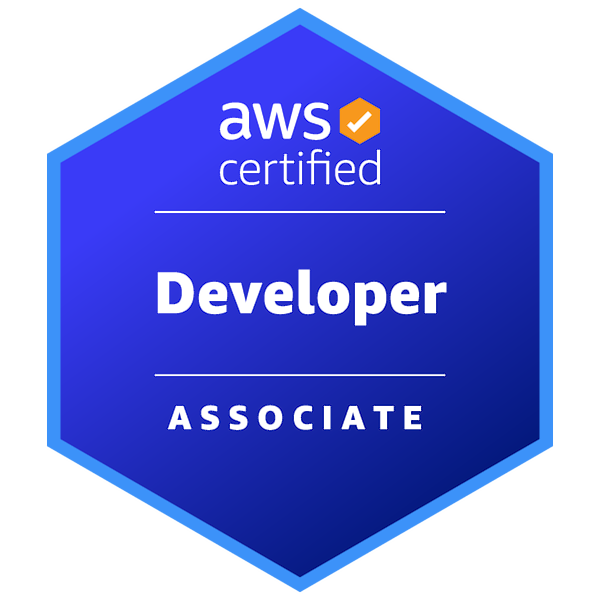](https://www.credly.com/badges/351e251d-50a0-46f7-9af0-f02cc598e37d/public_url)
[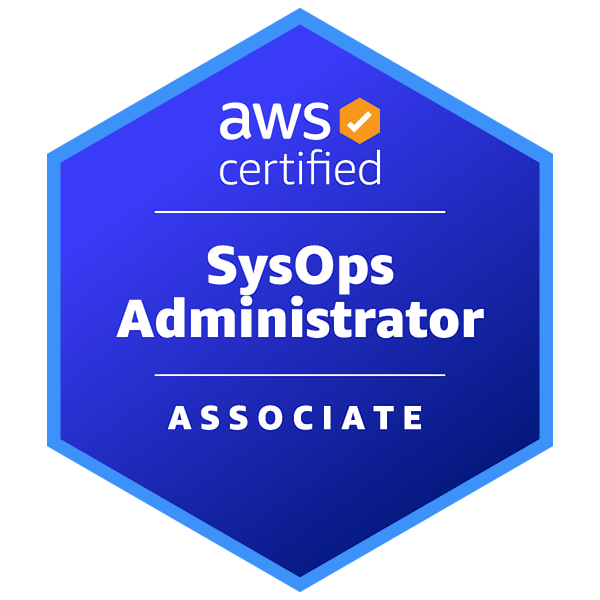](https://www.credly.com/badges/a386a7d3-3a0f-4a73-b885-c05fffa60613/public_url)
[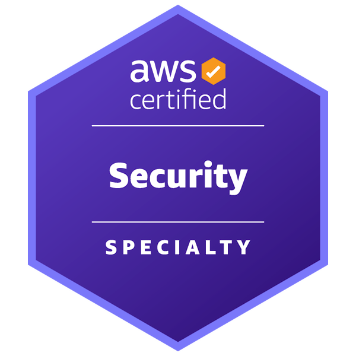](https://www.credly.com/badges/df832a61-e103-4b79-bd99-3c24c961ba02/public_url)

[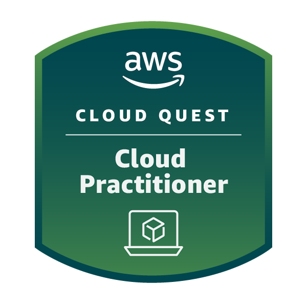](https://www.credly.com/badges/eafe3943-20f5-4e58-99e3-42db25bbdf1a/public_url)
[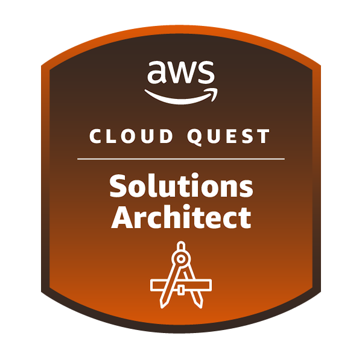](https://www.credly.com/badges/141fb19a-d7ca-4617-95dd-7234f93eced8/public_url)
[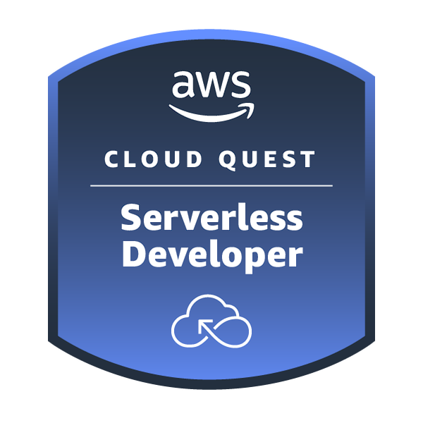](https://www.credly.com/badges/c73003a5-f543-4752-899d-4391c930ef7a/public_url)
[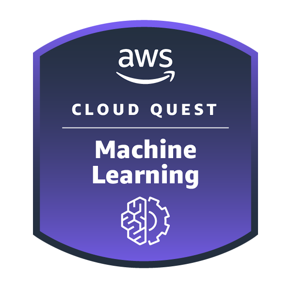](https://www.credly.com/badges/1b39641c-4bee-46f5-8ba8-2ccf82477c5c/public_url)
[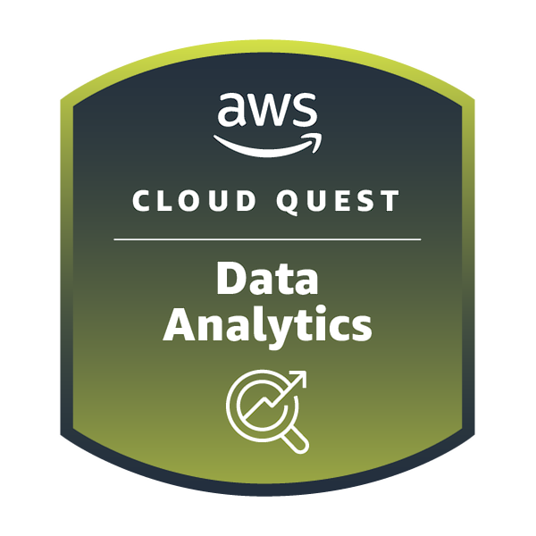](https://www.credly.com/badges/25f48fa0-c9f6-453a-86fe-7e9ab3dd4468/public_url)
[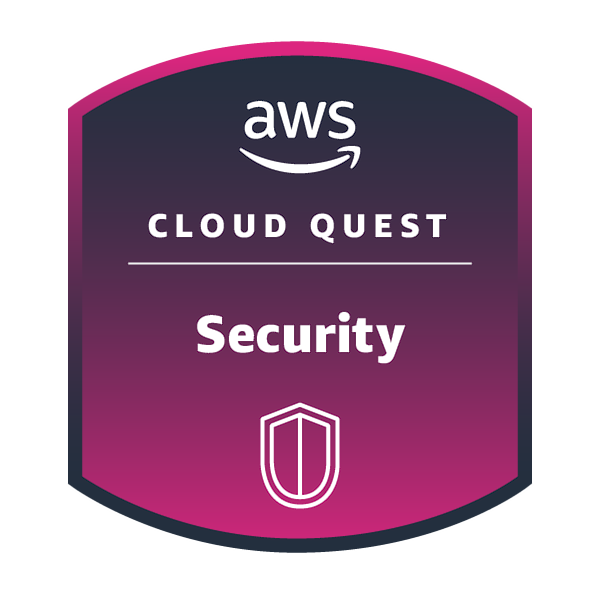](https://www.credly.com/badges/eb3e456f-7122-4a2f-838e-c46695852556/public_url)
[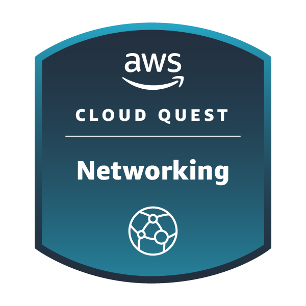](https://www.credly.com/badges/ffe4fc1b-8892-4c3a-9a13-b092ec58a61c/public_url)

### 🚀 HashiCorp Terraform

### ⚡ Scaled Agile (SAFe)

[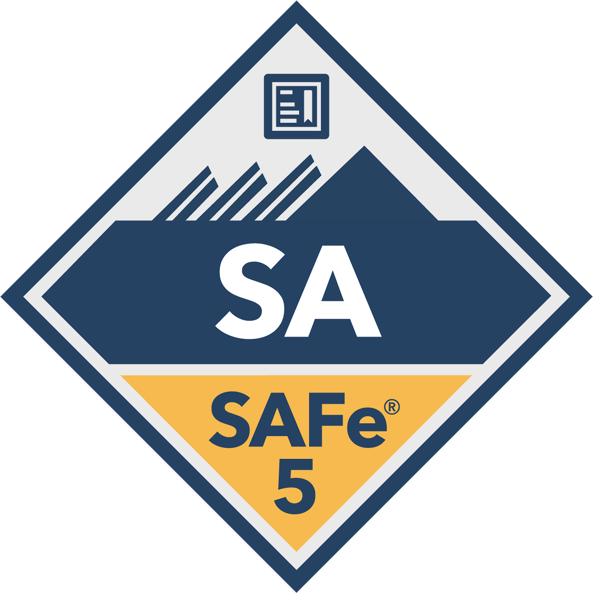](https://www.credly.com/badges/52d386b1-759d-4ed6-9672-4df695b1b34b/public_url)
[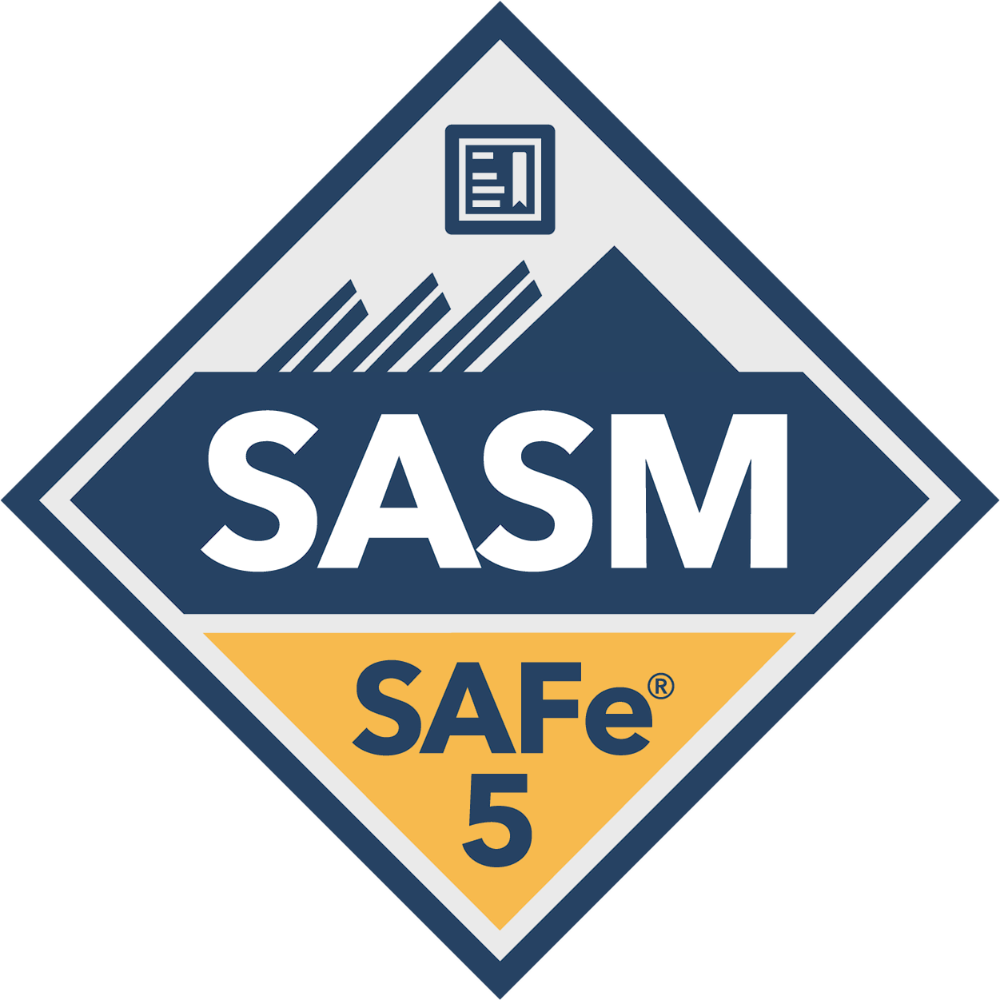](https://www.credly.com/badges/3b15baa7-437a-4b32-92f2-54b78ba3fc32/public_url)