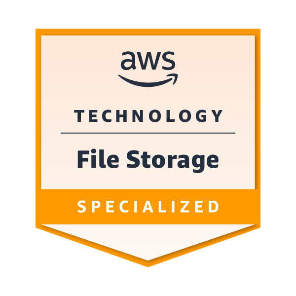
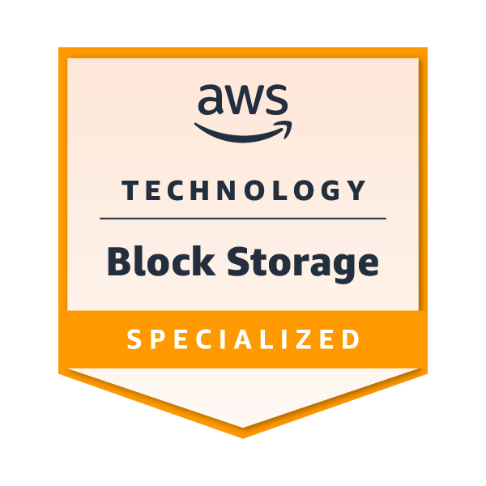

# Hello World, I'm Sébastien! 👋

Hey, my name is Sébastien! I'm an IT freak who love create and share cool stuff.

📫 How to reach me:

---

## 💼 Work stuff

I'm a Cloud Architect/DevOps Consultant at [AWS](https://aws.amazon.com) [Generative AI Innovation Center](https://aws.amazon.com/ai/generative-ai/innovation-center/) based in Warsaw! 🇵🇱

---

## 🛠️ Languages & Tools

---

## 🏆 Certifications & Badges

I'm always thrilled to learn new technologies, here are some certifications / skill badges that I've earned!

### :octocat: Github

### ☁️ Amazon Web Services (AWS)

### 🚀 HashiCorp (Terraform)

### ⚡ Scaled Agile (SAFe)

